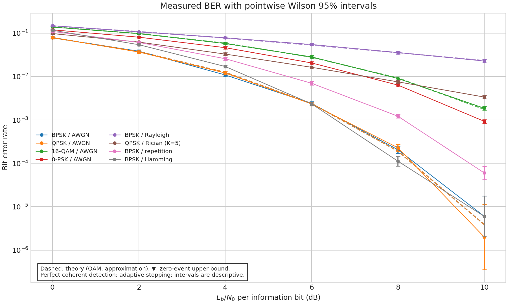
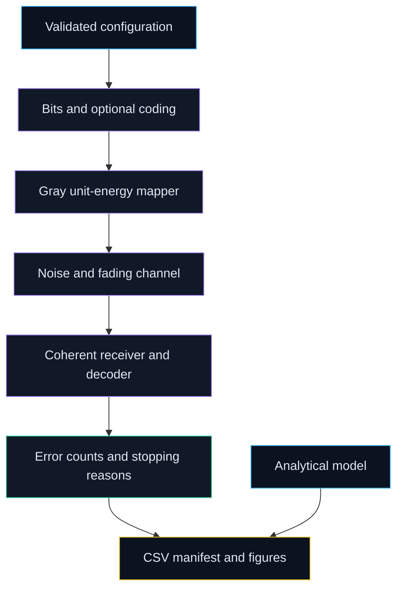

# Digital Communication Simulation

Compare modulation and coding choices through reproducible bit-error experiments checked against analytical theory.

[](https://github.com/Prajwal-Pratap-Yadav/Simulation-of-Digital-Communication-System/actions/workflows/ci.yml)
[](LICENSE)
[](pyproject.toml)
[](CHANGELOG.md)



## Why this matters

- **Problem:** modulation comparisons can be misleading when symbol energy and bit energy are mixed.
- **Approach:** normalize symbol energy, declare channel assumptions, count errors and compare validated cases with theory.
- **Outcome:** a runnable experiment exposes trade-offs and corrects the original QPSK energy/theory mismatch.

## Quickstart

Python and GNU Make on Linux/macOS are required. No datasets, GPU, cloud account or MATLAB toolbox is needed for Python.

```bash
git clone https://github.com/Prajwal-Pratap-Yadav/Simulation-of-Digital-Communication-System.git
cd Simulation-of-Digital-Communication-System
make setup run
```

The smoke run writes `reports/local/smoke/`; it checks operation and is **not a benchmark**.
Use `make reproduce` for the configured measured curves. For MATLAB/Octave, run
`addpath('matlab'); run_reference(17,400000,'reports/matlab_ber.csv')` from the repo.

## Features

- Gray-coded M-PSK and square M-QAM with unit average symbol energy.
- AWGN, independent flat Rayleigh and Rician channels with known receiver gains.
- Optional hard-decision repetition and Hamming coding with information-bit energy accounting.
- Validated JSON settings, independent seeded streams, bounded batches and explicit stopping reasons.
- Error-count CSVs, run manifests, theory overlays, constellation plots and descriptive Wilson intervals.
- MATLAB-compatible reference and Python contract, CLI and theory-agreement tests.

## Architecture



The runner generates complete coding blocks, maps bits, simulates a channel, and
counts decoded information-bit errors. It records counts before making figures;
theory is an independent comparison. Read [architecture](docs/architecture.md),
[conventions](docs/conventions.md) and [theory](docs/theory.md) for the assumptions.

## Design decisions

| Decision | Alternatives considered | Why | Trade-off |
|---|---|---|---|
| [Retain MATLAB and add Python](docs/adr/0001-maintain-matlab-and-add-python.md) | Replace the original; leave uploaded script alone | Preserve evidence and enable portable tests | Two implementations need independent checks |
| [Expose stopping and interval limits](docs/adr/0002-statistical-evidence.md) | Small fixed budget; claim sequential coverage | Bounded work and honest uncertainty | Wilson intervals are descriptive under adaptive stopping |
| Unit-energy symbol-rate model | Unnormalized constellations; full waveform radio | Comparable information-bit energy | No pulse-shaping or hardware conclusions |

## Results and limitations

✅ **Measured in this repo:** the hero and [CSV](reports/ber.csv) come from
`make reproduce` with the source commit, seed and environment recorded in the
[run manifest](reports/run_manifest.json). [EVIDENCE.md](docs/EVIDENCE.md) links
the numerical claims to their artifacts.

The key corrected comparison is that coherent Gray QPSK and BPSK have the same
theoretical BER at equal information-bit energy in AWGN; QPSK carries more bits
per symbol. Individual simulation estimates vary. One point can fall outside a
pointwise interval without invalidating all curves; these are not simultaneous
confidence bands. The QAM overlay is explicitly an approximation.

📓 **Historical evidence:** [original MATLAB code](legacy/original/code.m),
[observations](legacy/original/observations.md) and [PDF](legacy/original/Documentation.pdf)
are preserved byte for byte. Their QPSK normalization and conclusions contain
errors described in the conventions; they are not corrected-run results.

Limits: perfect synchronization, independent symbol fading, known channel gain,
ideal hard decisions and finite Monte Carlo budgets. Coding/fading bit errors
may be correlated. No eye diagram is generated without a pulse-shaped waveform.
No claim of hardware, bandwidth, field-radio or sequential-coverage validation is made.

## Repository map

| Path | Purpose |
|---|---|
| `src/commsim/` | Modem, channels, coding, theory, runner, plots and CLI |
| `matlab/` | Corrected toolbox-free reference |
| `legacy/original/` | Unchanged historical files |
| `configs/` | Measured-run and smoke settings |
| `tests/` | Characterization, contracts, theory and CLI tests |
| `reports/` | Measured CSVs, figures, manifests and checks |
| `docs/` | Architecture, conventions, evidence, data and ADRs |
| `scripts/` | Documentation verification |

## Development

`make setup`, `lint`, `typecheck`, `test`, `run`, `reproduce`, `docs`, `build`,
`security` and `clean` are available. `security` needs Gitleaks on PATH; CI
downloads its pinned, checksum-verified release. `clean` removes build outputs
and local smoke reports, preserving committed evidence. See [CONTRIBUTING](CONTRIBUTING.md).

## Roadmap

- [Stopping-aware confidence sequences](https://github.com/Prajwal-Pratap-Yadav/Simulation-of-Digital-Communication-System/issues/1).
- [Pulse shaping, matched filtering and an honest eye diagram](https://github.com/Prajwal-Pratap-Yadav/Simulation-of-Digital-Communication-System/issues/2).
- [CLI invalid-input tests — good first issue](https://github.com/Prajwal-Pratap-Yadav/Simulation-of-Digital-Communication-System/issues/3).

These are planned enhancements, not implemented capabilities.

## License and citation

[MIT](LICENSE). No external dataset is used; generated assets and legacy evidence
are described in [DATA.md](docs/DATA.md). Use [CITATION.cff](CITATION.cff) and cite
the exact source commit/configuration when reproducing a result. Questions about
vulnerabilities follow [SECURITY.md](SECURITY.md).
