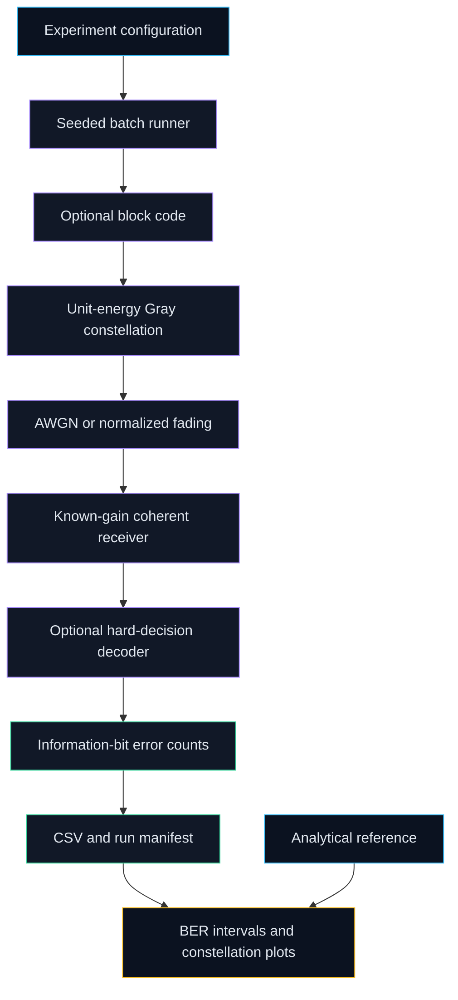

# Architecture

`Config` validates settings before work begins. Each curve/SNR pair receives an
independent child seed, and batch sizes bound memory. The modem separates labels
from constellation geometry; the receiver makes minimum-distance decisions.
Code rate enters the channel energy calculation. Error counts and stopping
reasons are exported before plots are generated. Original evidence is isolated
from maintained implementations and is never used to establish corrected results.

The MATLAB-compatible reference is a separate BPSK/QPSK AWGN implementation.
Both it and the Python tests compare against the same stated analytical model.
Cross-language random streams and individual sample trajectories are not identical.
